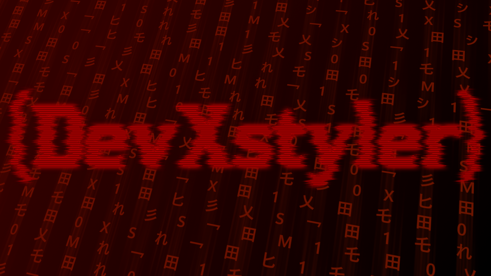

# 👋 Welcome to my GitHub Profile!

---

## ⚡ About Me

- 🖥️ Passionate about **software & game development**
- 🧠 Malware research – for **education** & **sandboxed** testing only
- 🔐 Enthusiastic about **Gray/White Hat hacking**
- 🧰 C++, Python, Assembly, and Lua developer

💡 More Interests

- Reverse Engineering  
- System Internals  
- Building custom tools  
- Creating experimental projects

---

---

## 📊 Skill Overview

| Domain              | Experience Level    |
|---------------------|---------------------|
| C++ / Windows API    | 🔥 Advanced          |
| Python               | ✅ Intermediate      |
| Ethical Hacking      | 🧪 Learning Phase    |
| Game Design          | 🎮 Experimental      |

---

## 📬 Connect With Me

> [!TIP]
> You can reach out for collaborations, questions or suggestions!

- 💬 Discord Server: [Join here](https://discord.gg/75W6mXRh5f)
- 💻 GitHub Projects: Always evolving – check back regularly!

---
